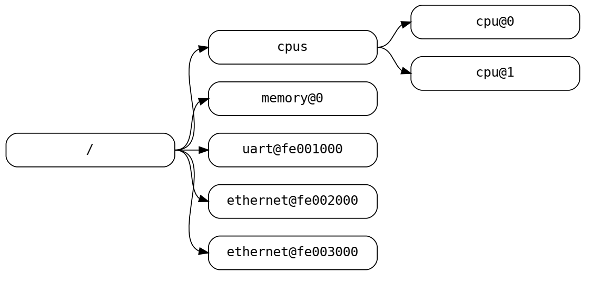
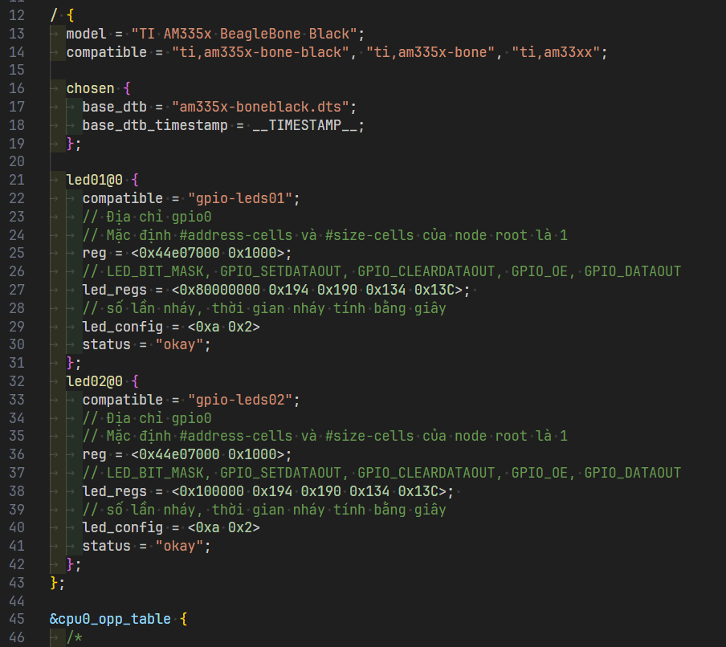

# [Devicetree](https://www.devicetree.org/)

The devicetree is a data structure for describing hardware. Rather than hard coding every detail of a device into an operating system, many aspects of the hardware can be described in a data structure that is passed to the operating system at boot time.

This specification is targeted towards the requirements of embedded systems. An embedded system typically consists of system hardware, an operating system, and application software that are custom designed to perform a fixed, specific set of tasks. This is unlike general purpose computers, which are designed to be customized by a user with a variety of software and I/O devices.

**Note**: Đối với BeagleBone Black:

- Ta có thể tìm thấy các file mã nguồn devicetree trong thư mục `kernelbuildscripts/KERNEL/arch/arm/boot/dts`.
- Ở trên board, các file devicetree được lưu ở đường dẫn `/boot/dtbs/kernel.version-boneXX/`. Ta có thể kiểm tra kernel version bằng cách đọc file `/boot/uEnv.txt`.

## Biên dịch

Để biên dịch file mã nguồn của devicetree (dạng `.dts`) thành file binary (dạng `.dtb`), ta sử dụng công cụ `dtc` (device tree compiler).

```sh
dtc -I dts -O dtb -o <output.dtb> <input.dts>
# hoặc
dtc -O dtb -o <output.dtb> <input.dts>
```

Để dịch ngược từ binary file thành text file ta sử dụng:

```sh
dtc -I dtb -O dts -o <output.dts> <input.dtb>
# Ví dụ:
dtc -I dtb -O dts -o boneblack.dts am335x-boneblack.dtb
```

Other source files can be included from a DTS file. The name of include files should end with “.dtsi”. Included files can in turn include additional files

```dts
#include "file.dtsi"
```

Một node có thể được định nghĩa ở nhiều file, giá trị thuộc được định tính cuối cùng sẽ được sử dụng khi biên dịch.

## Cấu trúc

A devicetree is a tree data structure with nodes that describe the devices in a system:

- Each node has property/value pairs that describe the characteristics of the device being represented.
- Each node has exactly one parent except for the root node, which has no parent.
- Nodes should not be designed for OS- or project- specific purposes. They should describe something which can be implemented by any OS or project.

A device in this context may be an actual hardware device, such as a UART. It may be part of a hardware device, such as the random-number generator in a TPM. It may also be a device provided through virtualisation, such as a protocol providing access to an I2C device attached to a remote CPU. A device may include functions implemented by firmware running in higher privilege levels or remote processors. There is no requirement that nodes in a device tree be a physical hardware device, but generally they have some correlation to physical hardware devices.

### Version

Dùng để chỉ phiên bản của devicetree. Ví dụ: `/dts-v1/;`

### Node names

Các node trong devicetree được đặt tên như sau:

```dts
node-name@unit-address
```

Trong đó:

- `node-name` là tên của node, có độ dài từ 1 đến 31 ký tự. The name of a node should be somewhat generic, reflecting the function of the device and not its precise programming model.
- The `unit-address` component of the name **is specific to the bus type on which the node sits**. The unit-address must match the first address specified in the `reg` property of the node. If the node has no `reg` property, the `@unit-address` must be omitted and the node-name alone differentiates the node from other nodes at the same level in the tree.

**Note**: The root node does not have a node-name or unit-address. It is identified by a forward slash `/`.



### Path names

A node in the devicetree can be uniquely identified by specifying the full path from the root node, through all descendant nodes, to the desired node.

The convention for specifying a device path is `/node-name-1/node-name-2/node-name-N`, for example `/cpus/cpu@1`

**Note**: The path to the root node is `/`

A unit address may be omitted if the full path to the node is unambiguous. If a client program encounters an ambiguous path, its behavior is undefined.

### Properties

Each node in the devicetree has properties that describe the characteristics of the node. Properties consist of a name and a value.

#### Property names

Property names are strings of 1 to 31 characters.

#### Property values

A property value is an array of zero or more bytes that contain information associated with the property. Properties might have an empty value if conveying true-false information.

### Standard Properties

#### compatible

Property name: `compatible`
Value type: `<stringlist>`

The `compatible` property value consists of one or more strings that define the specific programming model for the device. This list of strings should be used by a client program for device driver selection. They allow a device to express its compatibility with a family of similar devices, potentially allowing a single device driver to match against several devices. The first string in the list should be the most specific, and the last string should be the most general.

Đại loại code driver sẽ kiểm tra xem device có tương thích với driver không bằng cách so sánh chuỗi `compatible` của device với chuỗi `compatible` của driver. Nếu 2 chuỗi này giống nhau thì driver sẽ được chạy.

Example:

```dts
compatible = "fsl,mpc8641", "ns16550";
```

In this example, an operating system would first try to locate a device driver that supported fsl,mpc8641. If a driver was not found, it would then try to locate a driver that supported the more general ns16550 device type.

#### model

Property name: `model`
Value type: `<string>`

The model property value is a <string> that specifies the manufacturer’s model number of the device

#### phandle

Property name: `phandle`
Value type: `<u32>`

The phandle property specifies a numerical identifier for a node that is unique within the devicetree. The phandle property value is used by other nodes that need to refer to the node associated with the property.

Example:

```dts
pic@10000000 {
	phandle = <1>;
	interrupt-controller;
	reg = <0x10000000 0x100>;
};
```

A phandle value of 1 is defined. Another device node could reference the pic node with a phandle value of 1:

```dts
another-device-node {
	interrupt-parent = <1>;
};
```

#### status

Property name: `status`
Value type: `<string>`

The status property indicates the operational status of a device. The lack of a status property should be treated as if the property existed with the value of `"okay"`. Valid values are:

- `"okay"`: Indicates the device is operational.
- `"disabled"`: Indicates that the device is not presently operational, but it might become operational in the future (for example, something is not plugged in, or switched off).
- `"reserved"`: Indicates that the device is operational, but should not be used. Typically this is used for devices that are controlled by another software component, such as platform firmware.
- `"fail"`: Indicates that the device is not operational. A serious error was detected in the device, and it is unlikely to become operational without repair.
- `"fail-sss"`: Indicates that the device is not operational. A serious error was detected in the device and it is unlikely to become operational without repair. The sss portion of the value is specific to the device and indicates the error condition detected.

#### #address-cells and #size-cells

Property name: `#address-cells`, `#size-cells`
Value type: `<u32>`

The `#address-cells` and `#size-cells` properties may be used in any device node that has children in the devicetree hierarchy and describes how child device nodes should be addressed. The `#address-cells` property defines **the number of `<u32>` cells used to encode the address field in a child node’s `reg` property**. The `#size-cells` property defines **the number of `<u32>` cells used to encode the size field in a child node’s `reg` property**. If missing, a client program should assume a default value of `2` for `#address-cells`, and a value of `1` for `#size` cells.

**Note**: The `#address-cells` and `#size-cells` properties **are not inherited from ancestors** in the devicetree. They shall be explicitly defined.

Example:

```dts
soc {
	#address-cells = <1>;
	#size-cells = <1>;
	serial@4600 {
		compatible = "ns16550";
		reg = <0x4600 0x100>;
		clock-frequency = <0>;
		interrupts = <0xA 0x8>;
		interrupt-parent = <&ipic>;
	};
};
```

In this example, the `#address-cells` and `#size-cells` properties of the soc node are both set to `1`. This setting specifies that **one cell is required to represent an address and one cell is required to represent the size of nodes that are children of this node**.

#### reg

Property name: `reg`
Property value: `<prop-encoded-array>` encoded as an arbitrary number of (`address`, `length`) pairs.

The `reg` property describes the address of the device’s resources within the address space defined by its parent bus. Most commonly this means the **offsets** and **lengths** of memory-mapped IO register blocks, but may have a different meaning on some bus types. Addresses in the address space defined by the root node are CPU real addresses. The number of `<u32>` cells required to specify the `address` and `length` are bus-specific and are specified by the `#address-cells` and `#size-cells` properties in the parent of the device node. If the parent node specifies a value of `0` for `#size-cells`, the `length` field in the value of `reg` shall be omitted.

Suppose a device within a system-on-a-chip had two blocks of registers, a `32-byte` block at offset `0x3000` in the SOC and a `256-byte` block at offset `0xFE00`. The `reg` property would be encoded as follows (assuming `#address-cells` and `#size-cells` values of `1`): `reg = <0x3000 0x20 0xFE00 0x100>;`

#### v.v

### File layout

```dts
/dts-v1/;
[memory reservations]
/ {
	[property definitions]
	[child nodes]
};

// C style (/* ... \*/) and C++ style (//) comments are supported
```

Một node trong devicetree có thể được định nghĩa ở nhiều chỗ khác nhau trong các file `.dts`. Khi biên dịch, các file `.dts` sẽ được ghép lại thành một file duy nhất.

## Ví dụ

### Thêm node led01 vào devicetree cho BeagleBone Black

Mở file `am335x-boneblack.dts` trong thư mục `kernelbuildscripts/KERNEL/arch/arm/boot/dts/` và thêm vào file nội dung sau:

```dts
// ...

/ {
	// ...
	led01@0 {
		compatible = "gpio-leds01";
		// Địa chỉ gpio0
		// Mặc định #address-cells và #size-cells của node root là 1
		reg = <0x44e07000 0x1000>;
		// LED_BIT_MASK, GPIO_SETDATAOUT, GPIO_CLEARDATAOUT, GPIO_OE, GPIO_DATAOUT
		led_regs = <0x80000000 0x194 0x190 0x134 0x13C>; 
		// số lần nháy, thời gian nháy tính bằng giây
		led_config = <0xa 0x2>
		status = "okay";
	};
	led02@0 {
		compatible = "gpio-leds02";
		// Địa chỉ gpio0
		// Mặc định #address-cells và #size-cells của node root là 1
		reg = <0x44e07000 0x1000>;
		// LED_BIT_MASK, GPIO_SETDATAOUT, GPIO_CLEARDATAOUT, GPIO_OE, GPIO_DATAOUT
		led_regs = <0x100000 0x194 0x190 0x134 0x13C>; 
		// số lần nháy, thời gian nháy tính bằng giây
		led_config = <0xa 0x2>
		status = "okay";
	};
};

// ...
```



Để build lại kernel, ta cần chạy lệnh sau:

```sh
# kernelbuildscripts/tools/
rebuild.sh
```

Sau đó giải nén file có dạng `kernel.version-boneXX-dtbs.tar.gz` trong thự mục `kernelbuildscripts/deploy` và dịch ngược lại file file `arm335x-boneblack.dtb` thành file text để kiểm tra:

```sh
tar -xzf 5.15.148-bone42-dtbs.tar.gz
dtc -I dtb -O dts -o boneblack.dts am335x-boneblack.dtb
```

Để cập nhật devicetree trên board, ta cần copy file `am335x-boneblack.dtb` sau khi đã được giải nén vào thư mục `/boot/dtbs/kernel.version-boneXX/` ở trên board rồi khởi động lại board.

Để kiểm tra thông tin devicetree mà kernel đang sử dụng, ta có thể đọc các file trong thư mục `/proc/device-tree/`. Mỗi thư mục trong `/proc/device-tree/` tương ứng với một node trong devicetree. Các thuộc tính của node được lưu trong các file trong thư mục tương ứng với node đó.

## Viết driver cho devicetree

Để viết driver cho devicetree, ta cần:

1. Tạo instance của struct `of_device_id` để khai báo `compatible` string mà driver hỗ trợ.
2. Tạo các hàm `probe` và `remove` để khởi tạo và hủy thiết bị. Hai hàm này đều nhận tham số là con trỏ tới một struct có kiểu `platform_device`. Có rất nhiều trường trong struct này nhưng để lấy thông tin về devicetree, ta chỉ cần sử dụng trường `dev.of_node` và các hàm như `of_property_read_u32`, `of_property_read_u32_array`, `of_property_read_string`,... Đối với các các trường tiêu chuẩn thì sẽ có các struct và API riêng để đọc giá trị của chúng. Ví dụ trường `reg` sẽ được lưu trong kiểu struct `resource` và được đọc bằng hàm `platform_get_resource`.
3. Tạo instance của struct `platform_driver` và sử dụng macro `module_platform_driver` đăng ký nó với kernel. Macro này sẽ tạo ra các hàm `init` và `exit` cho driver.

TODO: build và chạy code trên mạch thật

```c
#include <linux/module.h>
#include <linux/kernel.h>
#include <linux/init.h>
#include <linux/of.h>
#include <linux/of_device.h>
#include <linux/platform_device.h>

static const struct of_device_id led_of_match[] = {
	{ .compatible = "gpio-leds01", },
	{ .compatible = "gpio-leds02", },
	{},
};

static int led_probe(struct platform_device *pdev)
{
	uint32_t reg[2];
	uint32_t led_regs[5], reg_data;
	uint32_t led_config[2];
	struct resource *res;
	int ret;
	pr_info("led_probe\n");
	ret = of_property_read_u32_array(pdev->dev.of_node, "reg", reg, sizeof(reg) / sizeof(reg[0]));
	if (!ret) {
		pr_info("reg[0]: %x, reg[1]: %x\n", reg[0], reg[1]);
	} else {
		pr_info("Cannot read reg property\n");
	}
	// or
	res = platform_get_resource(pdev, IORESOURCE_MEM, 0);
	if (res) {
		pr_info("start: %x, end: %x\n", res->start, res->end);
	} else {
		pr_info("Cannot get resource\n");
	}


	ret = of_property_read_u32_array(pdev->dev.of_node, "led_regs", led_regs, sizeof(led_regs) / sizeof(led_regs[0]));
	if (!ret) {
		pr_info("led_regs[0]: %x, led_regs[1]: %x, led_regs[2]: %x, led_regs[3]: %x, led_regs[4]: %x\n", led_regs[0], led_regs[1], led_regs[2], led_regs[3], led_regs[4]);
	} else {
		pr_info("Cannot read led_regs property\n");
	}

	ret = of_property_read_u32_array(pdev->dev.of_node, "led_config", led_config, sizeof(led_config) / sizeof(led_config[0]));

	// ioremap() is a function that maps a physical address to a virtual address
	gpio0_base = ioremap(res->start, res->end - res->start + 1);
	// set LED pin as output
	reg_data = readl_relaxed(gpio0_base + led_regs[3]);
	reg_data &= ~led_regs[0];
	writel_relaxed(reg_data, gpio0_base + led_regs[3]);

	for (int i = 0; i < led_config[0]; i++) {
		// turn on LED
		reg_data = readl_relaxed(gpio0_base + led_regs[3]);
		reg_data |= led_regs[0];
		writel_relaxed(reg_data, gpio0_base + led_regs[3]);
		// sleep
		msleep(led_config[1] * 1000);
		// turn off LED
		reg_data = readl_relaxed(gpio0_base + led_regs[4]);
		reg_data |= led_regs[0];
		writel_relaxed(reg_data, gpio0_base + led_regs[4]);
		// sleep
		msleep(led_config[1] * 1000);
	}

	return 0;
}

static int led_remove(struct platform_device *pdev)
{
	pr_info("led_remove\n");
	return 0;
}

static struct platform_driver led_driver = {
	.probe = led_probe,
	.remove = led_remove,
	.driver = {
		.name = "leds",
		.of_match_table = led_of_match,
	},
};

module_platform_driver(led_driver);

MODULE_LICENSE("GPL");
MODULE_AUTHOR("HMHuong");
MODULE_DESCRIPTION("A simple driver for led01");
```

Build chương trình trên với makefile giống như bài [Loadable Kernel Module](3-loadable-kernel-module.md#build-module).

Chương trình trên sẽ hoạt động như sau:

1. Khi module được load bằng lệnh `insmod`, hàm `module_init` sẽ được gọi. Sau đó với mỗi phần tử trong mảng `led_of_match`, hàm `led_probe` sẽ được gọi với tham số là con trỏ tới `platform_device` nếu tồn tại node tương ứng với `compatible` string đó trong devicetree. -> led02 sẽ nháy sau khi led01 nháy xong.
2. Khi module bị gỡ bỏ bằng lệnh `rmmod`, hàm `module_exit` sẽ được gọi. Hàm `led_remove` sẽ được gọi với tham số giống như của hàm `led_probe` nếu node tương ứng với `platform_device` đó vẫn còn tồn tại.

## Devicetree bindings

Để tra cứu các thuộc tính cần thiết cho một thiết bị ngoại vi trong devicetree, ta có thể xem trong file `Documentation/devicetree/bindings/` trong [mã nguồn kernel](https://elixir.bootlin.com/linux/latest/source/Documentation/devicetree/bindings). Mỗi thiết bị ngoại vi của một hãng sẽ có một file bindings riêng. Ví dụ file [omap-spi.yaml](https://elixir.bootlin.com/linux/latest/source/Documentation/devicetree/bindings/spi/omap-spi.yaml) mô tả các thuộc tính cần thiết cho một SPI controller trên SoC của hãng Texas Instruments.
