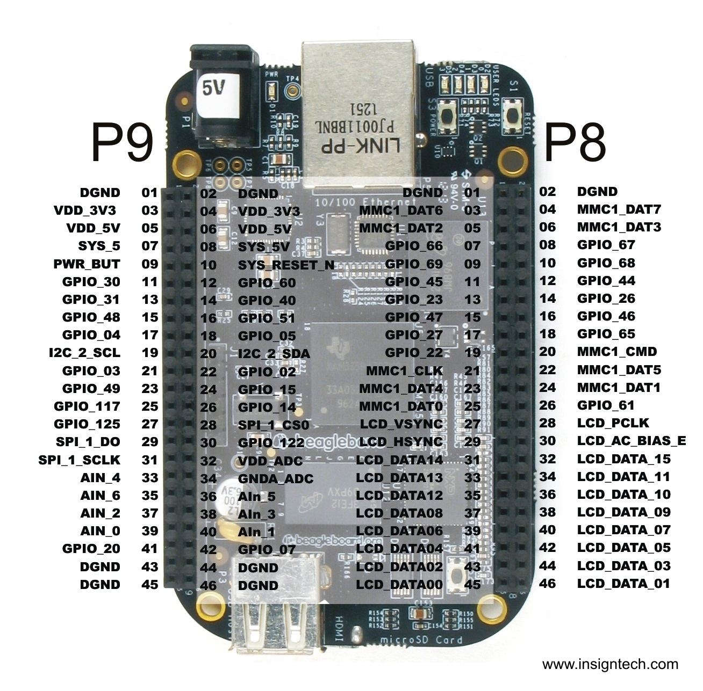

# Loadable kernel module (LKM)

LKM là một object file chứa mã máy để mở rộng kernel đang chạy (còn được gọi là base kernel) của hệ điều hành mà không cần phải reboot lại. Các LKMs thường được sử dụng để thêm hỗ trợ cho phần cứng mới (như một driver), file system, system call. Khi không cần sử dụng một LKM nữa ta có thể unload nó để giải phóng tài nguyên.

Without loadable kernel modules, an operating system would have to include all possible anticipated functionality compiled directly into the base kernel. Much of that functionality would reside in memory without being used, wasting memory, and would require that users rebuild and reboot the base kernel every time they require new functionality.

```bash
sudo apt install build-essential kmod
```

> Đọc thêm:
>
> - [1](https://sysprog21.github.io/lkmpg/)
> - [2](https://www.cs.otago.ac.nz/cosc440/labs/lab02.pdf)

## Một số lệnh thường sử dụng

### 1. `lsmod`

`lsmod` là lệnh dùng để liệt kê các module đang chạy trong kernel hoặc `cat /proc/modules`.

```bash
lsmod | grep module_name
```

### 2. `modinfo`

`modinfo` là lệnh dùng để hiển thị thông tin về một module.

### 3. `insmod`

`insmod` là lệnh dùng để load một module (có đuôi `.ko` - kernel object) vào kernel.

```bash
insmod module_name.ko
```

Lưu ý:

- Ta không thể dùng một module được build cho một kernel này để load vào một kernel khác.
- Nếu bật secure boot thì không thể load module không được ký. Do đó, cần tắt secure boot hoặc ký module trước khi load.

### 4. `rmmod`

`rmmod` là lệnh dùng để unload một module khỏi kernel.

```bash
rmmod module_name
```

### 5. `dmesg`

`dmesg` là lệnh dùng để xem log của kernel. Một số cờ thường sử dụng:

- `-c`: hiển thị log và xóa log hiện tại.

## Cấu trúc của một module

Một module bao gồm các phần sau:

1. `init_module()`: hàm này được gọi khi module được load vào kernel.
2. `cleanup_module()`: hàm này được gọi khi module được unload khỏi kernel.

```c
#include <linux/kernel.h>
#include <linux/module.h>

// a few macros to indicate the license for your module
MODULE_LICENSE("GPL");
MODULE_AUTHOR("Author name");
MODULE_DESCRIPTION("Module description");
MODULE_VERSION("1.0");

int init_module(void) {
	pr_info("Loading module\n");
	printk(KERN_INFO "Hello world\n");
	// a non 0 return means init_module failed; module can't be loaded
	return 0;
}

void cleanup_module(void) {
	pr_info("Unloading module\n");
}
```

## Build module

Ta cần phải có các header file của kernel để build module. Ví dụ đối với Ubuntu, ta có thể thực thi câu lệnh sau để xem các thông tin về header file:

```bash
sudo apt-get update 
apt-cache search linux-headers-`uname -r`
```

Sau đó, ta cài đặt các header file:

```bash
sudo apt-get install linux-headers-`uname -r`
```

Để build module cho Beaglebone Black, ta cần phải có cross compiler. Ta có thể tham khảo cách cài đặt cross compiler [ở đây](https://forum.digikey.com/t/debian-getting-started-with-the-beaglebone-black/12967#linux-kernel-6)

```makefile
obj-m += main.o

PWD := $(shell pwd)
CROSS=/home/leo/bbb/kernelbuildscripts/dl/gcc-11.4.0-nolibc/arm-linux-gnueabi/bin/arm-linux-gnueabi-
KER_DIR=/home/leo/bbb/kernelbuildscripts/KERNEL

all:
	make ARCH=arm CROSS_COMPILE=$(CROSS) -C $(KER_DIR) M=$(PWD) modules

clean:
	make -C $(KER_DIR) M=$(PWD) clean
```

## Blink LED trên BeagleBone Black

Đoạn chương trình sau sẽ nháy LED được kết nối với pin P9.13 trên BeagleBone Black.

Chi tiết về các thanh ghi của GPIO có thể xem [ở đây](https://www.ti.com/lit/ug/spruh73q/spruh73q.pdf).

Chức năng của các chân của P8 và P9 có thể xem [ở đây](https://docs.beagleboard.org/latest/boards/beaglebone/black/ch07.html).



```c
// comment out the following line to not use timer to blink LED
#define USE_TIMER_TO_BLINK_LED 1

#include <linux/delay.h>
#include <linux/gpio.h>
#include <linux/kernel.h>
#include <linux/module.h>
#include <linux/timer.h>

// a few macros to indicate the license for your module
MODULE_LICENSE("GPL");
MODULE_AUTHOR("Leo");
MODULE_DESCRIPTION("A simple Hello world LKM!");
MODULE_VERSION("0.1");

#define GPIO0_BASE_ADDR 0x44E07000
// 0x1000 = 4KB
#define GPIO0_SIZE 0x1000
#define GPIO_OE 0x134
#define GPIO_DATAOUT 0x13C
#define GPIO_CLEARDATAOUT 0x190
#define GPIO_SETDATAOUT 0x194

#define LED (1 << 31)

// __iomem is a macro that is defined in the kernel headers to indicate that the pointer is a pointer to memory-mapped I/O
void __iomem *gpio0_base;

#if USE_TIMER_TO_BLINK_LED
struct timer_list blink_timer;
static void blink(struct timer_list *t) {
#else
void blink(void) {
#endif
	int i;
	for (i = 0; i < 10; ++i) {
		writel_relaxed(LED, gpio0_base + GPIO_SETDATAOUT);
		// FIXME: using msleep() is not a good idea
		// use msleep() inside a timer callback function can cause a kernel panic
		// because msleep() will sleep the current process, and the timer callback function is running in interrupt context
		// use dmesg to see the kernel panic message
		msleep(1000);
		writel_relaxed(LED, gpio0_base + GPIO_CLEARDATAOUT);
		msleep(1000);
	}
}

// The init_module() function is called when the module is loaded into the kernel
int init_module(void) {
	uint32_t reg;
	printk(KERN_INFO "Loading hello module...\n");

	// ioremap() is a function that maps a physical address to a virtual address
	gpio0_base = ioremap(GPIO0_BASE_ADDR, GPIO0_SIZE);

	reg = readl_relaxed(gpio0_base + GPIO_OE);
	reg &= ~LED; // set LED pin as output
	writel_relaxed(reg, gpio0_base + GPIO_OE);

	// if you don't use the timer, the init_module() has to wait until we done blinking the LED
	// and you cannot do anything else, even Ctrl+C
#if USE_TIMER_TO_BLINK_LED
	pr_info("use timer to blink LED\n");
	timer_setup(&blink_timer, blink, 0);
	add_timer(&blink_timer);
#else
	pr_info("not use timer to blink LED\n");
	blink();
#endif

	pr_info("Hello world\n");
	return 0;
}

// The cleanup_module() function is called just before the module is unloaded from the kernel
void cleanup_module(void) {
	pr_info("Unloading hello module...\n");
#if USE_TIMER_TO_BLINK_LED
	// always remember to free your resources when you are done
	del_timer_sync(&blink_timer);
#endif
	pr_info("Goodbye Mr.\n");
}
```

Note: sửa file `c_cpp_properties.json` của vscode như sau để loại bỏ các lỗi về đường dẫn tới thư viện:

```json
{
    "configurations": [
        {
            "name": "Linux",
            "includePath": [
                "${workspaceFolder}/**",
                "/home/leo/bbb/kernelbuildscripts/KERNEL/include/**",
                "/home/leo/bbb/kernelbuildscripts/KERNEL/arch/arm/include/**",
                "/home/leo/bbb/kernelbuildscripts/dl/gcc-11.4.0-nolibc/arm-linux-gnueabi/lib/gcc/arm-linux-gnueabi/11.4.0/include/**"
            ],
            "defines": [
                "KBUILD_MODNAME=\"BBB_MODULE\"",
                "__GNUC__",
                "__KERNEL__",
                "MODULE"
            ],
            "compilerPath": "",
            "cStandard": "c17",
            "cppStandard": "gnu++14",
            "intelliSenseMode": "linux-gcc-x64"
        }
    ],
    "version": 4
}
```